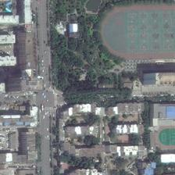
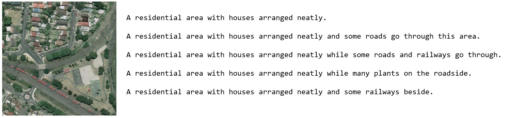
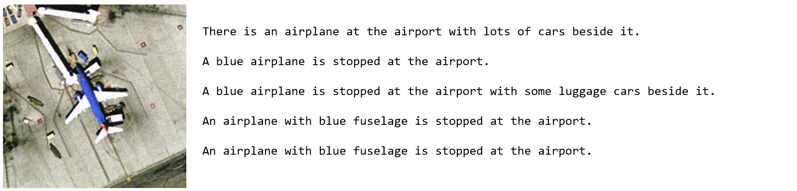

# RemoteGLM
**用于遥感图像场景分析的中文多模态大模型 | Chinese multimodal large-scale model for remote sensing image scene analysis**
<p align="center" width="100%">

</p>

## 介绍
目前的通用多模态大模型[LLaVA](https://github.com/haotian-liu/LLaVA)、[MiniGPT-4](https://github.com/Vision-CAIR/MiniGPT-4)等模型，在广泛意义上取得了较好的效果，但这些多模态大模型在细分垂直领域的应用效果相对较差。目前还几乎没有用于遥感图像场景分析的多模态大模型，这在一定程度上受限于遥感图像相关数据集的稀缺，因此基于通用多模态大模型的微调为遥感大模型的研究提供了可能。

VisualGLM-6B 是清华大学开源开源的，支持图像、中文和英文的多模态对话语言模型，由语言模型ChatGLM-6B与图像模型BLIP2-Qformer结合得到，整体模型共78亿参数，它能够整合视觉和语言信息，可用来理解图片，解析图片内容，结合模型量化技术，用户可以在消费级的显卡上进行本地部署。

因此，RemoteGLM模型基于VisualGLM-6B，在遥感图像-中文数据集上进行微调得到，在遥感图像场景分析任务中具有较好的结果。

## 效果展示
|遥感图像|VisualGLM-6B|RemoteGLM|
|:-|:-|:-|
|| 这是一张城市地图的卫星照片。图片显示了一个繁忙的十字路口，周围是几栋公寓楼和一条街道。道路两侧有许多汽车停泊，远处还有一座大型建筑物。天空晴朗，云朵漂浮在天空中。 | 这是一张遥感图片，展示了一条道路两旁有许多住宅区。道路中央有一条横穿马路的十字路口，两侧有多条车道。住宅区内有一些房屋整齐排列，道路尽头有一个大型公园。|
| | |

## 方法

## 数据集
一些常见的用于训练遥感视觉语言模型的[数据集](https://github.com/lzw-lzw/awesome-remote-sensing-vision-language-models#dataset)都是英文构建的，无法直接用于中文微调。因此参照[XrayGLM](https://github.com/WangRongsheng/XrayGLM)的方法构建中文数据集。

可以使用常见的遥感字幕数据集构建中文遥感图像-文本对，常见数据集的信息如下：
|数据集|大小|示例|下载链接
|:-|:-|:-|:-|
|Sydney_captions|613张图片，每张5句描述||[BaiduYun](https://pan.baidu.com/s/1hujEmcG#list/path=%2F)
|UCM_captions|2100张图片，每张5句描述||[BaiduYun](https://pan.baidu.com/s/1mjPToHq)
|RSICD|10921张图片，每张5句描述||[BaiduYun](https://pan.baidu.com/s/1bp71tE3#list/path=%2F) [GoogleDrive](https://drive.google.com/open?id=0B1jt7lJDEXy3aE90cG9YSl9ScUk)|

*Notes:数据集中一些图片描述不足5句，通过随机复制现有的句子扩充到5句。*
实验中使用Sydney_captions和UCM_captions两个数据集进行初步验证，分别对应json文件为data文件夹下的[Sydney-zh-prompt.json](data/Sydney-zh-prompt.json)和[UCM-zh-prompt.json](data/UCM-zh-prompt.json)，同时使用两个数据集进行训练时对应的文件为[SydneyUCM-zh-prompt.json](data/SydneyUCM-zh-prompt.json).

## 使用方法
### 环境配置
使用pip安装依赖
```bash
pip install -r requirements.txt
# 国内使用镜像安装依赖
pip install -i https://mirrors.aliyun.com/pypi/simple/ -r requirements.txt
```
此时默认会安装deepspeed库（支持sat库训练），此库对于模型推理并非必要，同时部分Windows环境安装此库时会遇到问题。 如果想绕过deepspeed安装，我们可以将命令改为
```bash
pip install -i https://mirrors.aliyun.com/pypi/simple/ -r requirements_wo_ds.txt
pip install -i https://mirrors.aliyun.com/pypi/simple/ --no-deps "SwissArmyTransformer>=0.3.6"
```

### 权重下载
|训练权重|下载链接|微调方法|
|:-|:-|:-|
|checkpoints-XrayGLM-300|  |LoRA|
|checkpoints-XrayGLM-1500|  |LoRA|

### 命令行推理
```python
python cli_demo.py --from_pretrained checkpoints/checkpoints-remoteGLM-1500
```
### 网页gradio运行
```python
python web_demo.py --from_pretrained checkpoints/checkpoints-remoteGLM-1500
```
此时可通过`http://127.0.0.1:7860`在线进行测试。

## 模型复现
### 数据集下载
按照上面给出的链接下载Sydney_captions和UCM_captions数据集，将数据集中的图片放到train_images文件夹下。

### 中文数据集准备
<details><summary><b>下载的几个数据集中的caption json文件结构较为杂乱，包括许多不需要的键值，每张图片包括分散的5个描述。<b></summary>

```json
{
	"images": [{
		"sentids": [0,
		1,
		2,
		3,
		4],
		"imgid": 0,
		"sentences": [{
			"tokens": ["A",
			"residential",
			"area",
			"with",
			"houses",
			"arranged",
			"neatly"],
			"raw": "A residential area with houses arranged neatly .",
			"imgid": 0,
			"sentid": 0
		},
		{
			"tokens": ["A",
			"residential",
			"area",
			"with",
			"houses",
			"arranged",
			"neatly",
			"and",
			"some",
			"roads",
			"go",
			"through",
			"this",
			"area"],
			"raw": "A residential area with houses arranged neatly and some roads go through this area .",
			"imgid": 0,
			"sentid": 1
		},
		{
			"tokens": ["A",
			"residential",
			"area",
			"with",
			"houses",
			"arranged",
			"neatly",
			"while",
			"some",
			"roads",
			"and",
			"railways",
			"go",
			"through"],
			"raw": "A residential area with houses arranged neatly while some roads and railways go through .",
			"imgid": 0,
			"sentid": 2
		},
		{
			"tokens": ["A",
			"residential",
			"area",
			"with",
			"houses",
			"arranged",
			"neatly",
			"while",
			"many",
			"plants",
			"on",
			"the",
			"roadside"],
			"raw": "A residential area with houses arranged neatly while many plants on the roadside .",
			"imgid": 0,
			"sentid": 3
		},
		{
			"tokens": ["A",
			"residential",
			"area",
			"with",
			"houses",
			"arranged",
			"neatly",
			"and",
			"some",
			"railways",
			"beside"],
			"raw": "A residential area with houses arranged neatly and some railways beside .",
			"imgid": 0,
			"sentid": 4
		}],
		"split": "train",
		"filename": "1.tif"
	},
  ……
]}
```
</details>
  
因此先对其进行预处理，将对应每张图片的5个描述拼接，执行如下代码：
```bash
cd data
python data/transform.py
```
可得到类似如下格式的json文件：

```bash
[
    {
        "imged_id": "1.tif",
        "caption": "A residential area with houses arranged neatly .  A residential area with houses arranged neatly and some roads go through this area .  A residential area with houses arranged neatly while some roads and railways go through .  A residential area with houses arranged neatly while many plants on the roadside .  A residential area with houses arranged neatly and some railways beside .  "
    },
    ……
]
```
然后利用openai的api对每张图像对应的英文描述翻译为中文文本，考虑到一些重复描述的存在，可以在提供的prompt中进行约束，代码中使用prompt“下面的几个句子是几个人描述同一张遥感图像的英文句子，不同句子之间可能有重复或相似的部分，请你根据这些句子，输出描述该遥感图像内容的一段中文文本，要保证结果的通顺简洁，且应该去除了相似或重复的部分，文本以及分句要符合中文习惯”进行翻译，也可以自行试验其他prompt，生成风格化的描述：
```bash
python translation_en2zh.py
```

最后，更改json文件中的图像路径，并加入用于送入VisualGLM的prompt“这张遥感图像展现了什么场景？”，生成最终用于微调VisualGLM的文件：
```bash
python generate_prompt.py
```

## 问题及改进方向
1.由于遥感图像领域缺少大规模、高精度、精细描述的图文数据集，基于UCM_captions等生成的中文数据集质量较低，仍存在大量重复描述，或者图片描述较短，总体来说质量较低。这需要进一步探索更高质量遥感图文数据集，另一种可行方向是在此前生成的数据集上进一步利用chatgpt进行扩写或改写，提高数据集的质量。

2.该项目只是对基于微调的遥感图像大模型的初步探索，结果仍存在不少问题。该项目使用Visual-6B作为基座模型，今后可能在更大的模型上进行训练。

## 致谢
1.该项目基于[VisualGLM-6B](https://github.com/THUDM/VisualGLM-6B)进行微调。

2.该项目参照了[XrayGLM](https://github.com/WangRongsheng/XrayGLM)的思路准备数据集。

3.该项目利用chatgpt生成中文数据集。


